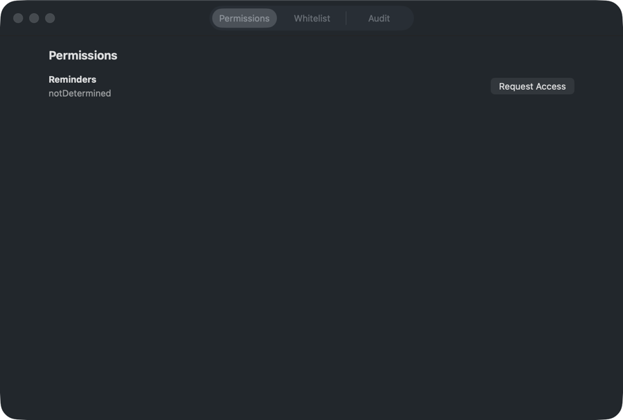

# Fluegel 🪽 — One trusted wing for local automation

[](Package.swift)
[](Package.swift)
[](LICENSE)

Fluegel is a macOS menu bar app that runs explicitly approved CLI tools through a stable GUI process with the required privacy permissions. It is for local automation agents whose shell, SSH, launchd, or terminal process cannot reliably retain those macOS grants.



The first supported permission is Reminders, commonly used with [`rem`](https://github.com/BRO3886/rem). Fluegel also includes a CLI for status checks, permission requests, whitelist changes, command execution, and audit reads.

## Install

Fluegel is currently built from source. It requires macOS 14 or later and a Swift 6 toolchain from Xcode or the Xcode Command Line Tools.

```bash
git clone https://github.com/steipete/fluegel.git
cd fluegel
scripts/build-app.sh

APP_DIR="${APP_DIR:-$HOME/Applications}"
BIN_DIR="${BIN_DIR:-$HOME/.local/bin}"
mkdir -p "$APP_DIR" "$BIN_DIR"
ditto dist/Fluegel.app "$APP_DIR/Fluegel.app"
install -m 0755 dist/fluegel "$BIN_DIR/fluegel"
```

Add `~/.local/bin` to `PATH` if it is not already available in your shell.

## Quick start

Start the app in the logged-in GUI session, then check the bridge:

```bash
open "${APP_DIR:-$HOME/Applications}/Fluegel.app"
"${BIN_DIR:-$HOME/.local/bin}/fluegel" status
```

A running app responds with `ok` and the number of whitelisted commands.

## Run Reminders through Fluegel

Install [`rem`](https://github.com/BRO3886/rem#installation), confirm that `command -v rem` returns an absolute path, and start Fluegel. Then request Reminders access:

```bash
FLUEGEL="${BIN_DIR:-$HOME/.local/bin}/fluegel"
REM_PATH="$(command -v rem)"

"$FLUEGEL" permissions request reminders
"$FLUEGEL" allow add --path "$REM_PATH" --permission reminders --name rem
"$FLUEGEL" run -- "$REM_PATH" lists
```

macOS shows its Reminders prompt during the permission request. Adding or removing a whitelist entry requires local device-owner authentication.

## How it works

The menu bar app owns the macOS privacy grant and listens on a private Unix domain socket. The CLI authenticates with a per-user local token, and the app accepts a run only when the executable's absolute path exactly matches an enabled whitelist entry whose permissions are currently granted.

The settings window has three views:

- **Permissions** shows the current Reminders grant and requests access.
- **Whitelist** adds, updates, and removes exact executable paths.
- **Audit** shows recent allowed and denied runs.

## CLI

| Command | Purpose |
| --- | --- |
| `fluegel status` | Check the bridge and count whitelist entries |
| `fluegel permissions …` | Inspect or request a permission |
| `fluegel allow …` | List, add, or remove exact executable paths |
| `fluegel run -- …` | Run a whitelisted command through the app |
| `fluegel audit list` | Read recent allow and deny decisions |

See the [CLI reference](docs/cli.md) for every form and its exit behavior.

## Security boundary

Fluegel is a convenience boundary for trusted local automation. It is not a sandbox or a privilege-escalation framework: approved commands run as the current user with the app's environment and privacy grants. The [security model](docs/security.md) describes the socket, token, whitelist, audit trail, and limitations.

## Troubleshooting

If the CLI cannot connect, the permission status is unexpected, or a command is denied, see [Troubleshooting and data locations](docs/troubleshooting.md).

## Development

```bash
swift test
scripts/build-app.sh
```

The build produces `dist/Fluegel.app` and `dist/fluegel`. See the [development notes](docs/development.md) for local packaging and the repository's deployment helper.

## License

MIT. See [LICENSE](LICENSE).
